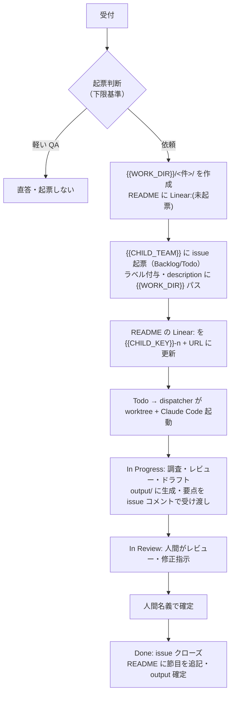

<!--
テンプレート: 新しい業務ワークスペース repo の docs/linear-integration.md を作るための雛形。
セットアップ時に {{...}} プレースホルダを埋め、docs/linear-integration.md として配置する。
プレースホルダ一覧と埋め方は skill の references/parameters.md を参照。
このコメントブロックは配置時に削除してよい。
-->

# Linear 連携設計（{{REPO}} ↔ Linear）

> 目的: 本リポジトリ（{{DOMAIN}}のエージェントワークスペース）と Linear を接続するための **対応関係・接続方法・正の所在・ディレクトリ運用**を定義する。
> このドキュメントだけで、本 repo で作業する Claude Code セッションが Linear をどう読み書きし、{{WORK_DIR}} とどう同期するかが分かる状態を目指す。
>
> 対象 Linear teams: `{{PARENT_TEAM}}`（親）, `{{CHILD_TEAM}}`（子）

---

## 0. 最重要サマリ（先に読む）

- **チーム対応**: `{{PARENT_TEAM}}`（親）= 本リポジトリ全体（ワークスペース基盤 ＋ 非案件の{{DOMAIN}}業務）。`{{CHILD_TEAM}}`（子）= `{{WORK_DIR}}`（部門からの個別依頼・作業単位、**作業 1 件 = issue 1 件 = {{WORK_DIR}} ディレクトリ 1 件**）。親は子の issue をロールアップ表示する。
- **接続方法**: 主経路は **Linear MCP**。本 repo で作業する Claude Code が issue の一覧取得・作成・コメント・ステート変更・ラベル付与を行う。
- **正の所在（二重管理を避ける鉄則）**: ステータス・受け渡し・会話・監査証跡は **Linear が正**。受領原本・作業ファイル・成果物・作業メモは **`{{WORK_DIR}}`（= git）が正**。両者を相互リンクするが、内容は複製しない。
- **binding**: {{WORK_DIR}} ディレクトリ名は命名規則（`{{DIR_NAMING}}`）に従う。ディレクトリ README の先頭に `Linear:` フィールドで issue 識別子と URL を記録し、Linear issue の説明には {{WORK_DIR}} 相対パスを書いて相互参照する。
- **責任モデル**: コパイロット型。AI はドラフト・調査・起票まで、{{DOMAIN}}判断／承認の名義は常に人間。Linear の `In Review` = 人間レビュー段。

---

## 1. なぜ接続するか

作業単位が `{{WORK_DIR}}` に記録されても、「いま何件が、どの状態で、いつから止まっているか」を横断で見る台帳が無い。Linear を接続することで:

1. **台帳ができる** — 作業 1 件 = issue 1 件。件数・状態・滞留が可視化される（ステータスの正）。
2. **AI と人間の受け渡し点になる** — Claude が生成したドラフトを issue コメントに置き、人間がレビューして確定する非同期分業。
3. **監査証跡が残る** — 誰がいつ受け付け、どう判定し、誰の名義で確定したか。コパイロット型責任モデルの担保。
4. **AI への委任単位になる** — issue は「スコープ・受け入れ条件・証跡」を備えた、Claude Code に仕事を渡す自然な単位。

---

## 2. チーム ↔ リポジトリの対応

- **`{{PARENT_TEAM}}`（親）** ⇔ リポジトリ全体（`scripts/` / `docs/` などワークスペース基盤 ＋ 非案件の{{DOMAIN}}機能 issue）
  - **`{{CHILD_TEAM}}`（子）** ⇔ `{{WORK_DIR}}`（個別依頼・作業単位）。親でロールアップ表示される
    - `{{CHILD_KEY}}-n` issue ⇔ `{{WORK_DIR}}/{{DIR_NAMING}}/`（1 件 = 1 issue = 1 ディレクトリ）

| Linear team | 対応スコープ | 何を issue にするか |
| --- | --- | --- |
| **{{PARENT_TEAM}}**（親） | リポジトリ全体のうち **{{WORK_DIR}} 以外**。ワークスペース基盤（scripts / docs / 連携）と、非案件の{{DOMAIN}}機能。 | 横断・基盤タスク、非案件の{{DOMAIN}}業務。**{{WORK_DIR}} ディレクトリは切らない**。 |
| **{{CHILD_TEAM}}**（子） | `{{WORK_DIR}}`。部門からの個別依頼・作業単位。 | **依頼 1 件 = issue 1 件**。{{WORK_DIR}} ディレクトリと 1:1 対応。 |

- 親子関係により、{{PARENT_TEAM}} のビューでは {{CHILD_TEAM}} の issue もロールアップされ、{{DOMAIN}}全体の滞留を一望できる。
- 「個別依頼かどうか」が team の振り分け基準。部門からの個別依頼 → {{CHILD_TEAM}}、それ以外の業務 → {{PARENT_TEAM}}。

> **Team identifier**: workspace = `{{WORKSPACE}}`、{{CHILD_TEAM}} の identifier = `{{CHILD_KEY}}`（issue は `{{CHILD_KEY}}-n`）、{{PARENT_TEAM}} = `{{PARENT_KEY}}`（`{{PARENT_KEY}}-n`）。issue URL は `https://linear.app/{{WORKSPACE}}/issue/<ID>`。

---

## 3. 接続方法（メカニズム）

### 3.1 主経路: Linear MCP（Claude Code ⇔ Linear）

本 repo で作業する Claude Code は、**Linear MCP サーバー**を通じて Linear を read/write する。これが「接続」の実体である。

| 操作 | 使う MCP ツール | 用途 |
| --- | --- | --- |
| 一覧取得 | `list_issues` / `list_projects` / `list_teams` | 未処理の把握、triage 対象の抽出 |
| 起票 | `save_issue` | 依頼を {{CHILD_TEAM}} に、横断作業を {{PARENT_TEAM}} に起票 |
| ドラフト受け渡し | `save_comment` | 調査結果・ドラフトを issue コメントに投稿 |
| ステート遷移 | `save_issue`（state 指定） | Backlog→Todo→In Progress→In Review→Done |
| 属性付与 | `save_issue`（label 指定） / `create_issue_label` | 種別・機密度・区分ラベル |
| 記録参照 | `get_issue` / `list_comments` | {{WORK_DIR}} 作業時に issue の文脈を取得 |

- **書き込み権限の扱い**: Linear への write は外向きの操作。ラベル体系の新設・ステート遷移・クローズなど後戻りしにくい操作は、人間の承認・指示のもとで行う（コパイロット型）。

### 3.2 実行レイヤ: Orca worktree（issue 単位の作業場）

{{CHILD_TEAM}} issue を「issue 単位の Orca worktree」で処理するローカル実行フローを別途定義している → `docs/orca-linear-worktree-workflow.md`。要点: Linear team `{{CHILD_TEAM}}` ⇄ Orca `{{CHILD_TEAM}}` lane worktree ⇄ その配下（Orca 系譜）に issue ごとの worktree を切り Claude Code を起動する。dispatcher は `scripts/orca-linear-dispatch.mjs`（Todo の issue のみ・冪等・オンデマンド）。

---

## 4. 正の所在（source of truth 分担）

二重管理（同じ情報が Linear と {{WORK_DIR}} の両方にあり、どちらが正か分からない状態）を避けるため、情報の種類ごとに正を一つに定める。**相互リンクはするが、内容は複製しない。**

| 情報 | 正の所在 | もう一方の役割 |
| --- | --- | --- |
| ステータス（受付/対応中/レビュー中/完了） | **Linear** | ディレクトリ README は節目のみ人手で追記 |
| 受け渡し・進捗の会話 | **Linear**（issue コメント） | — |
| 期限・担当・優先度 | **Linear** | — |
| 種別・機密度・区分の分類 | **Linear**（ラベル） | README にも分類を明記 |
| 監査証跡（誰がいつ何を判断） | **Linear**（issue 履歴） | — |
| 受領原本 | **`{{WORK_DIR}}/<件>/received/`**（git） | Linear には置かない（機密・容量） |
| 作業ファイル | **`{{WORK_DIR}}/<件>/work/`**（git） | — |
| 成果物 | **`{{WORK_DIR}}/<件>/output/`**（git） | 確定版の要点のみ issue コメントで受け渡し |
| 経緯の逐語記録 | **`{{WORK_DIR}}/<件>/context/`**（git） | — |
| 作業メモ（当事者・経緯・分類・次アクション） | **`{{WORK_DIR}}/<件>/README.md`** | Linear の issue 説明は要約＋リンクに留める |

### ドラフトの同期ルール

1. **作業と確定版の保管は `output/`（git が正）**。ファイルとしてバージョン管理する。
2. **レビューのための受け渡しは issue コメント**。人間が Linear 上でレビュー・修正指示できるよう、確定版（または要点）をコメントに貼る。
3. コメントには対応する `output/` のファイル名を明記し、どのコメントがどのファイルかを追える状態にする。

原則: **長文・原本性のあるものは git、レビューと受け渡しは Linear**。同じ全文を両方で編集し続けない。

---

## 5. ディレクトリ構成と binding

### 5.1 命名

```
{{WORK_DIR}}/{{DIR_NAMING}}/
├── README.md    # 先頭に Linear フィールド（下記）＋当事者・経緯・分類・次アクション
├── received/    # 受領原本
├── context/     # 経緯の逐語記録
├── work/        # 作業ファイル
└── output/      # 成果物
```

ディレクトリ名に issue 識別子（`{{CHILD_KEY}}-12` 等）は**付けない**。理由: issue 採番前にディレクトリを作れる、既存の改名が不要、識別子は README で解決できる。

### 5.2 相互参照（binding）

- **{{WORK_DIR}} → Linear**: ディレクトリ README の先頭に次のブロックを置く。

  ```markdown
  # <ディレクトリ名>

  - Linear: {{CHILD_KEY}}-12 — https://linear.app/{{WORKSPACE}}/issue/{{CHILD_KEY}}-12
  - Team: {{CHILD_TEAM}}
  ```

  issue 未起票の段階では `Linear: (未起票)` とし、起票時に識別子と URL を埋める。

- **Linear → {{WORK_DIR}}**: issue の説明（description）の冒頭に {{WORK_DIR}} 相対パスを書く。双方向に辿れる状態にする。

### 5.3 対応の粒度

- **依頼 1 件 = {{CHILD_TEAM}} issue 1 件 = {{WORK_DIR}} ディレクトリ 1 件**。
- **軽い QA・数分で終わる問い合わせは起票せず {{WORK_DIR}} も切らない**（チケットインフレの回避）。受け渡しが発生し・成果物が出て・数分で終わらない依頼から issue + ディレクトリを切る。

---

## 6. {{CHILD_TEAM}} のラベル・属性設計

依頼の属性を Linear のラベルで構造化する。ラベルは MCP `create_issue_label` で新設し、`save_issue` で付与する。

<!-- 以下のラベル群は「例」。この業務で意味のある分類軸に置き換える。埋めたら本コメントは削除してよい。 -->

| ラベル群 | 値（例） |
| --- | --- |
| **種別** | {{LABEL_TYPE_VALUES}} |
| **区分** | {{LABEL_CATEGORY_VALUES}} |
| **機密度** | 一般 / 部署内 / 限定 |

- **機密度と閲覧制御**: 実効的な閲覧制限は Linear の private team／プラン（Business 以上）に依存する。ラベルは分類の宣言であり、アクセス制御そのものではない。

### ステータス運用（ワークフロー state に対応づけ）

{{CHILD_TEAM}} の state（Backlog / Todo / In Progress / In Review / Done / Canceled）を作業ライフサイクルに割り当てる:

| state | 意味 |
| --- | --- |
| Backlog | 受付済み・未着手（トリアージ待ち） |
| Todo | 着手予定（dispatcher が worktree を切る対象） |
| In Progress | Claude Code が調査・レビュー・ドラフト作成中 |
| **In Review** | **ドラフトを人間がレビュー中**（コパイロット型の受け渡し段） |
| Done | 確定・クローズ。記録を {{WORK_DIR}} に確定 |
| Canceled | 取り下げ・対応不要 |

---

## 7. {{PARENT_TEAM}}（親）側の運用

- 横断・基盤タスク（連携設計・スクリプト改善 等）と、非案件の{{DOMAIN}}機能を {{PARENT_TEAM}} の issue として直接管理する。
- これらは {{WORK_DIR}} ディレクトリを切らない。成果物は `docs/` や `scripts/` など該当箇所に置き、issue から相対パスで参照する。
- 分類ラベルは必要になった時点で新設する（先に作り込まない）。

---

## 8. 1 件のライフサイクル（フロー）



---

## 9. スコープ外・将来

- **機密度の実効的アクセス制御**（private team / プラン選定）— 別途検討。
- **triage の自動起動**（cron / webhook / Cloud 実行）— Orca はローカルで webhook を受けられないためポーリング（`docs/orca-linear-worktree-workflow.md` 参照）。
- **Linear projects の活用** — 作業単位は「1 件 = 1 issue」のフラット運用。大型プロジェクトで束ねる運用は {{PARENT_TEAM}} 側で別途検討する。
